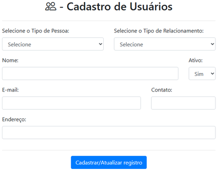
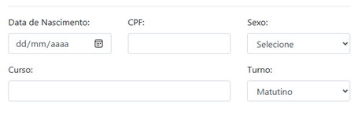
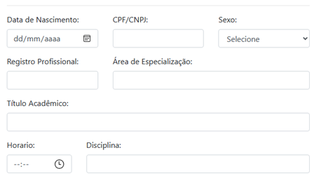
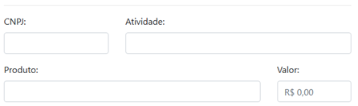

# Sistema de Cadastro de Usuário

Bem-vindo ao Sistema de Cadastro de Usuário desenvolvido como parte do curso de Análise e Desenvolvimento de Sistemas do Senac, matéria PROJETO INTEGRADOR III: DESENVOLVIMENTO DE SISTEMAS ORIENTADO A OBJETO.

## Descrição do Projeto

Este projeto visa fornecer uma solução abrangente para o cadastro de usuários, abordando diferentes tipos de pessoas, como físicas e jurídicas, e variados relacionamentos, incluindo professores, fornecedores e alunos. O sistema é flexível e adapta os campos exibidos com base nas seleções feitas, oferecendo uma experiência intuitiva e eficiente para o usuário.

## Tecnologias Utilizadas

- HTML5
- CSS3 (Bootstrap)
- JavaScript (para interatividade dinâmica)
- [Bootstrap Icons](https://icons.getbootstrap.com/) (para ícones)
- jQuery
- PHP
- SQL Server 2012

## Como Usar

1. Clone o repositório em sua máquina local.
2. Utilize o Xampp ou configure o IIS em sua máquina e copie os 3 (três) arquivos .php para a pasta do localhost.
3. Instale o SQL Server 2012 e crie um banco de dados chamado `Cadastro_Usuario`.
4. Execute o script SQL para criar a tabela `cadastro_usuario`.
5. Abra o arquivo `view.php` em seu navegador.

## Recursos Adicionais

- **Filtragem Dinâmica:** Seleção de tipo de pessoa e relacionamento aciona a exibição dinâmica de campos específicos.
- **Validação de Formulário:** Campos obrigatórios e formatos específicos são validados no lado do cliente.
- **Botão de Cadastrar/Atualizar:** Facilita o envio e processamento das informações do formulário.

- ## Tela de Cadastro

- # Tela Principal

  

- **Tipo de Pessoa:**
  - Opções: Pessoa Física, Pessoa Jurídica

- **Tipo de Relacionamento:**
  - Opções: Professor, Fornecedor, Aluno

 
- **Nome:**
  - Campo de texto

- **Ativo:**
  - Opções: Sim, Não

- **E-mail:**
  - Campo de texto

- **Contato:**
  - Campo de texto

- **Endereço:**
  - Campo de texto

- # Tela Aluno

- # Tela Professor

- # Tela Fornecedor

## Autores

- Douglas Barbosa Rodrigues
- Guilherme Batista Pereira dos Santos
- Natalia Barbara Soares
- Olívia Rodrigues Baptista
- Paulo Eduardo da Rosa Riccardi
- Rachel Emily de Souza Damasceno
- Roberto Barreto de Gouveia Filho
- Wilson da Gloria Nunes

---

